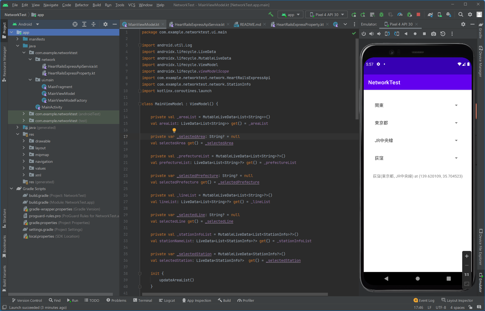

## Network API TEST

Web APIを使用するプログラムのテスト版です。  
[HeartRails Express](http://express.heartrails.com/api.html) APIを使用して、
地域名から駅名までのドリルダウンを実行します。

コードの流用は自由ですが、APIの[使用規約](https://www.heartrails.com/ja/company/terms)に従ってください。
